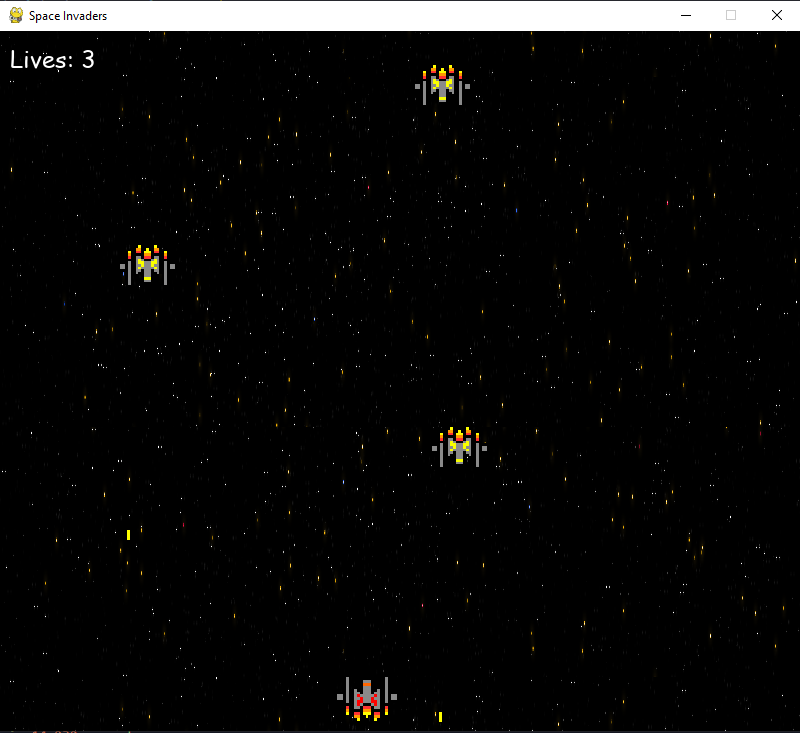

# Attempt of making pygame game on my own

## Description

First version of Space Ivaders game by Wiktor Byrka (WiktorB2004)

I know I it is not made the best way, but I wanted to try code the game on my own without help of any tutorials. Thanks to this project I developed basic project management skills and learned how to organize and write clean code.

## Screenshoots

